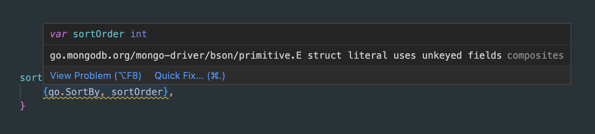
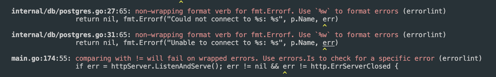

# Assisted Linting for Go

The company I work at has a microservices backend composed of a large number of Go services. We recently added a Github action to run a linter on the repo when a pull request (PR) is made. Almost all of our repos were failing this check so it wasn't required but it meant that all PRs showed a failed check. This was a bit annoying so I decided to start trying to fix all the warnings on some services.

To begin I picked a relatively small service that had ~90 linter warnings. My first attempt was to go through the entire repo and fix every warning in one commit. I was able to fix all the warnings, but the resulting PR had almost 50 files and over 1000 lines including unit tests. This would be a bit unwieldly for reviewers and didn't allow for an incremental approach to the linting. So instead I decided to lint the repo package by package, with a separate PR for each one. Although a bit slower, this was a much better approach as it allowed for manageable PRs of 5-10 files and 50-150 or so lines. For this first service it ended up being 9 PRs. Not too bad! So I decided to try some other services.

My strategy up until this point was to just view each file in my IDE, go to where warnings were highlighted, and fix them.



This worked okay for the first service, but it was a bit tedious and repetitive for the next couple services. I wanted a way to automatically be taken to each warning 1 by 1 as I fix them for each file in a package. This would greatly speed up my process by reducing the small amounts of time wasted scrolling to warnings and opening files. Many of the warnings being fixed were repetitive or had easy fixes that weren't suggested by the IDE. So I also wanted a way to automatically suggest warnings and apply them if I approved. This would save lots of time from not having to type out the same solution over and over again.

I set out to write a Python script that would help with this. The linter we were using is [golangci-lint](https://golangci-lint.run/). It can be run from the command line like so:

```bash
$ golangci-lint run
```

which produces output like this:



The first step is to parse the linter output into a list of warnings. Then for each warning we can parse out the file path, line number and column position and open the warning in an IDE. For VSCode this can be done with the following command:

```bash
$ code --goto <file>:<line>:<column>
```

Then we can just wait for the user to fix the warning and press enter to continue to the next warning. 

This was already a lot better, but it was still a hassle having to fix each warning manually. I added a step after opening a warning to check if the linter warning matched a list of known warning regexes. If it did, it would suggest a fix and ask the user if they wanted to apply it. If yes, the warning would be fixed automatically. Otherwise, the fix would be skipped and the user could fix the warning manually. This was a huge time saver as it allowed me to fix many warnings with just a single key press.

For example, a frequent warning was:

```
comparing with != will fail on wrapped errors. Use errors.Is to check for a specific error
```

Meaning code that looks like this:

```go
if err != http.ErrServerClosed {
```

should be changed to:

```go
if !errors.Is(err, http.ErrServerClosed) {
```

which can be done with some regex in Python.

Another very common warning was:

```
var-naming: struct field TenantId should be TenantID (revive)
``` 

This is a bit harder to fix because it requires renaming all occurences of that field which may span multiple files. However, most IDEs have a shortcut to rename all occurences of a variable. So for warnings like this I copied the desired name (in this case `TenantID`) to the clipboard and opened the file to the variable. Then the user can just apply the rename shortcut and paste the desired name to fix the warning.

Here is a video of what using it looks like in action: [Youtube link](https://youtu.be/4JBL96Sf5iE)

In the future, I'd like to improve this by adding a more complete list of warning fixes, and potentially simplifying the use of it by making it an IDE extension. If you'd like to try it out or learn more, you can check out the repo [here](https://github.com/rileythomp/golint).
